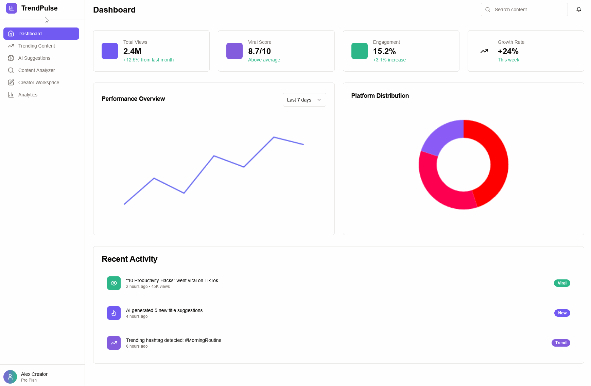

# TrendPulse 📈

TrendPulse is an AI-powered app that analyzes viral YouTube and TikTok Shorts and generates optimized titles, tags, hooks, and content strategies for creators.

## 🚀 Live Demo

**[Click here to try TrendPulse](https://trendpulse-fixed.netlify.app/)** *(You can update this link after the Netlify deployment is complete)*


---

## 🔥 Features
- Analyze trending Shorts content.
- Generate viral titles, tags, and hook ideas.
- Get content strategy tips (best time to post, structure, etc.).
- Filter by platform and topic.

---

## 🤖 Tech Stack
- **Frontend:** React, Vite, TypeScript
- **Styling:** Tailwind CSS
- **UI Components:** shadcn/ui, Radix UI
- **AI:** OpenAI API
- **Deployment:** Netlify

---

## 🚧 MVP Status & Story
TrendPulse is a rapidly developed MVP, built in just a few hours originally using Replit and the OpenAI API. It demonstrates core functionality for analyzing viral Shorts and generating optimized content strategies for creators.

The project highlights fast prototyping using AI tools and showcases how effective a solo developer can be with a focused goal and the right technology.

Planned improvements include:
- Saving user sessions
- Multi-platform analytics
- UI refinements and deeper content analysis

---

## ⚙️ Getting Started Locally

To run this project on your own machine:

1.  Clone the repository:
    ```bash
    git clone [https://github.com/DaveRLashley/TrendPulse-Fixed.git](https://github.com/DaveRLashley/TrendPulse-Fixed.git)
    ```
2.  Navigate to the project directory:
    ```bash
    cd TrendPulse-Fixed
    ```
3.  Install the necessary dependencies:
    ```bash
    npm install
    ```
4.  Start the local development server:
    ```bash
    npm run dev
    ```
5.  Open the URL shown in the terminal (usually `http://localhost:5173`) in your browser.
